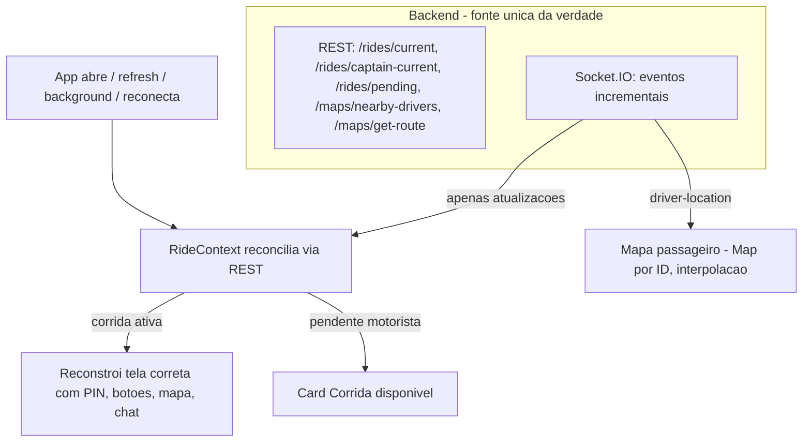

# Experiência completa da corrida ativa (Motorista + Passageiro)

## Relatório da auditoria (Etapa 1 — concluída)

### Causa raiz de cada problema

**1. Corrida ativa some após refresh/fechar/reabrir (bug crítico)**
- Não existe `RideContext` nem store global: a corrida vive em `useState` local + `location.state` do React Router (efêmero).
- [frontend/src/modules/passenger/pages/Riding.jsx](frontend/src/modules/passenger/pages/Riding.jsx) L21: `const { ride } = location.state || {}` — morre no refresh, sem fetch de restauração, e a rota `/riding` não tem `UserProtectWrapper` (join do socket falha pois `user` fica vazio).
- [frontend/src/modules/passenger/pages/Home.jsx](frontend/src/modules/passenger/pages/Home.jsx) L220–320: chama `GET /rides/current` no mount, mas não trata status `started` — não navega para `/riding` (Home fica "idle" com corrida rolando no servidor).
- [frontend/src/modules/driver/pages/CaptainHome.jsx](frontend/src/modules/driver/pages/CaptainHome.jsx): não chama `GET /rides/captain-current` no mount — motorista com corrida aceita (pré-start) perde toda a UI (botões "Estou a caminho/Cheguei/PIN") no refresh.
- [frontend/src/modules/driver/components/ConfirmRidePopUp.jsx](frontend/src/modules/driver/components/ConfirmRidePopUp.jsx) L15: `rideStatus` local hardcoded `'accepted'` — mesmo restaurando, os botões voltariam ao estado inicial.
- `Start.jsx` sempre manda para `/home` ou `/captain-home`, nunca para a tela de corrida em andamento.
- Nenhum handler de `visibilitychange`/`pageshow`/`focus` re-sincroniza a corrida (só o Wake Lock usa `visibilitychange`).

**2. Corrida pendente some (timeout)**
- [frontend/src/modules/driver/components/RidePopUp.jsx](frontend/src/modules/driver/components/RidePopUp.jsx) L11–35: countdown de 20s fecha o painel (sem declinar no servidor — estado fantasma).
- Backend não tem endpoint de pull de corridas `requested` compatíveis — se o motorista perdeu o evento `new-ride` (app fechado, push falhou), a corrida nunca reaparece.
- Backend não tem job de expiração/re-despacho; o auto-expire de 10 min é lazy (só roda em `GET /rides/current` do passageiro).

**3. Motoristas online invisíveis para o passageiro**
- Não existe endpoint nem evento socket de motoristas próximos. O passageiro só vê o motorista após o aceite (`captain-location-updated`).
- Backend já tem tudo que precisa: `locationGeoJSON` com índice `2dsphere`, `availabilityFilter` (isOnline + lastSeenAt TTL + aprovado + canReceiveRides) e o pipeline `update-location-captain`.

**4. Navegação do motorista inexistente**
- Leaflet 1.9.4 (provider padrão) é 2D top-down: sem bearing, pitch, rotação de câmera ou rotação de marcador. Zoom fixo 14 + um único `fitBounds`.
- O provider Google já existe ([frontend/src/services/maps/googleMapsProvider.js](frontend/src/services/maps/googleMapsProvider.js)) mas não expõe `heading`/`tilt` no contrato ([frontend/src/services/maps/mapContract.js](frontend/src/services/maps/mapContract.js)).
- GPS não captura `heading`/`speed` ([frontend/src/contexts/LocationContext.jsx](frontend/src/contexts/LocationContext.jsx) envia só `{lat,lng}`).
- Rota é buscada no OSRM público direto do browser (LiveTracking L239–246), sem steps/manobras — viola "backend como fonte única".

**5. Bugs backend encontrados**
- `waiting_passenger` está no enum e nos alvos permitidos de `update-status`, mas falta em `VALID_ORIGINS_BY_TARGET` → transição sempre lança erro.
- Room `ride_<id>` usa socketId do momento do despacho; após reconexão o socket novo não re-entra na room (perde `ride-taken`/`ride-cancelled`).
- Status `'ongoing'` usado em filtros mas ausente do enum (código morto).

### Decisões confirmadas
- Navegação com provider **Google Maps** (heading/tilt nativos; requer Map ID vetorial via `VITE_GOOGLE_MAPS_MAP_ID`).
- Navegação completa **apenas no CaptainRiding**; passageiro mantém mapa 2D com tracking suave.

---

## Plano de implementação

### Fase A — Persistência da corrida ativa (Etapa 2)

Criar **`frontend/src/contexts/RideContext.jsx`** — fonte de reconciliação com o backend:
- Ao montar (com sessão ativa), em `socket connect`, `visibilitychange→visible`, `pageshow` e `online`: chama `GET /rides/current` (passageiro) ou `GET /rides/captain-current` (motorista) e reconstrói o estado.
- Expõe `activeRide`, `setActiveRide`, `refreshRide()`. Socket apenas atualiza (`ride-status-updated`, `ride-confirmed`, etc. passam pelo context).
- Redirecionamento automático para a tela correta:
  - Passageiro: `requested` → Home com LookingForDriver; `accepted..waiting_passenger` → Home com WaitingForDriver (PIN restaurado); `started` → `/riding`.
  - Motorista: `accepted..waiting_passenger` → CaptainHome com ConfirmRidePopUp no status real; `started` → `/captain-riding`.

Ajustes por tela:
- `Riding.jsx`: reidratar via context/backend (não mais `location.state`); adicionar `UserProtectWrapper` na rota `/riding` em [frontend/src/routes/passengerRoutes.jsx](frontend/src/routes/passengerRoutes.jsx).
- `Home.jsx`: tratar `started` navegando para `/riding`; mover restauração para o RideContext.
- `CaptainHome.jsx`: restaurar corrida aceita no mount via context; `ConfirmRidePopUp` deriva `rideStatus` de `ride.status` do backend.
- `Start.jsx`: com sessão, deixar o RideContext decidir a rota (corrida ativa > home).
- Backend: corrigir `VALID_ORIGINS_BY_TARGET` para aceitar `waiting_passenger`; em `join` de captain/user no [Backend/socket.js](Backend/socket.js), re-adicionar o socket à room `ride_<id>` da corrida ativa (corrige room stale pós-reconexão).

### Fase B — Corridas pendentes sem timeout (Etapa 3)

Backend:
- Novo endpoint `GET /rides/pending` (auth captain): corridas `requested` compatíveis (raio 15 km via `$nearSphere` sobre `pickupCoordinates`, mesmo `vehicleType`, dentro da janela de expiração de 10 min), reutilizando a lógica de `dispatchRideToCaptains`.

Frontend (motorista):
- Remover o countdown de 20s do `RidePopUp` — a oferta só sai da tela em: aceite próprio, `ride-taken`, `ride-cancelled` ou "Ignorar" manual (que apenas minimiza para o card).
- Card persistente "Corrida disponível" + botão "Aceitar corrida" na `CaptainHome` enquanto houver pendente compatível (lista mantida em `Map` por rideId).
- Sincronizar pendentes via `GET /rides/pending`: no mount, no `socket connect`, no retorno do background (`visibilitychange`) e no `online`.
- Aceitação continua pelo `POST /rides/:id/accept` atômico existente (409 = já aceita → remove card).

### Fase C — Motoristas online no mapa do passageiro (Etapa 4)

Backend ([Backend/socket.js](Backend/socket.js) + rota de snapshot):
- Room `map-viewers`: passageiro entra via evento `subscribe-drivers-map` (com sua posição) e sai em `unsubscribe`/disconnect.
- Em `update-location-captain`: se o captain está disponível (não em corrida), emitir `driver-location` para a room (throttle por captain). Emitir `driver-offline`/`driver-busy` quando: toggle offline, disconnect com TTL vencido, aceite de corrida; `driver-available` ao finalizar.
- Snapshot inicial: `GET /maps/nearby-drivers?lat&lng` (auth user) — motoristas disponíveis no raio, retornando `{ id, vehicleType, location }` (sem dados pessoais).

Frontend (Home do passageiro / LiveTracking):
- Camada de marcadores gerenciada por `Map` por driverId — atualização incremental, sem recriar lista; cleanup de listeners no unmount.
- Ícones por `vehicleType` (moto/carro/auto — usar os assets existentes `vehicle-*.png`), interpolação suave (rAF, já existe base no LiveTracking) e rotação por delta de posição quando disponível.
- Resync completo (snapshot + re-subscribe) ao voltar do background e no reconnect do socket.

### Fase D — Navegação do motorista (Etapas 5 e 6)

Contrato e provider:
- Estender [frontend/src/services/maps/mapContract.js](frontend/src/services/maps/mapContract.js) com `moveCamera({center, heading, tilt, zoom}, animate)`, `setMarkerRotation(id, deg)` e padding/offset de câmera. Leaflet ganha no-ops graciosos (fallback 2D).
- Implementar no `googleMapsProvider.js` via mapa vetorial (`mapId`) + `moveCamera`; marcador do veículo com rotação (AdvancedMarkerElement + CSS transform).

GPS:
- `LocationContext` passa a capturar `heading`, `speed` e `accuracy` de `coords` (fallback: bearing calculado por delta entre pontos consecutivos quando parado/sem heading).

Rota pelo backend (fonte única da verdade):
- Novo endpoint `GET /maps/get-route?origin&destination` que retorna `{ polyline, distance, duration, steps[] }` (Google Routes API já suporta steps; OSRM com `steps=true` no fallback OSM). LiveTracking para de chamar OSRM público direto.

CaptainRiding — modo navegação:
- Follow mode com câmera rotacionada pelo bearing, tilt ~45–60°, veículo no terço inferior (offset de câmera), movimentos suaves com interpolação (sem recentralizar a cada fix de GPS).
- Zoom dinâmico: velocidade alta/rodovia → zoom out; aproximação de curva/chegada → zoom in. Nunca fixo.
- Rota destacada + banner compacto de próxima manobra (conversão, distância, nome da rua) quando steps disponíveis.
- UI minimalista: mapa prioritário; chat, telefone, cancelar, status e dados do passageiro em painel recolhível compacto.

### Fase E — Testes (Etapa 7)

- Rodar suites existentes (Jest no Backend, Vitest no frontend) e adicionar testes para: endpoint `/rides/pending`, `/maps/nearby-drivers`, transição `waiting_passenger`, restauração do RideContext.
- Roteiro manual: refresh/fechar/background/reconexão para motorista e passageiro em cada status; dois motoristas aceitando simultaneamente; corrida pendente reaparecendo; motoristas entrando/saindo/movendo no mapa do passageiro.

### Garantias finais
- Sem dados mockados e sem GPS simulado (apenas `watchPosition` real).
- Backend permanece a única fonte da verdade: REST reconstrói, socket só atualiza.
- Corrida ativa/pendente nunca mais se perde após refresh, fechar ou reabrir o PWA.

### Requisito de ambiente
- Navegação Google exige `VITE_GOOGLE_MAPS_API_KEY` e um **Map ID vetorial** (`VITE_GOOGLE_MAPS_MAP_ID`) — sem ele, heading/tilt não funcionam (o mapa cai para raster). Vou deixar fallback gracioso para o Leaflet nas demais telas.