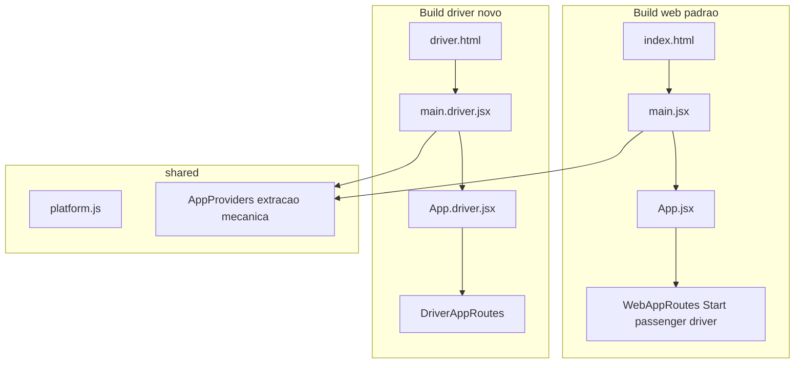

# Preparar frontend para Capacitor (motorista) — seams

## Decisão
Preparar **só seams** no frontend: entry/shell do motorista, role/platform, builds separados e guards de PWA. **Não** instalar Capacitor nem gerar `android/`/`ios/` nesta etapa.

Primeiro o `build:driver` precisa nascer e funcionar no navegador. Capacitor depois é só empacotamento nativo em cima de `dist-driver/`.

## Resultado esperado

```
frontend/
├── index.html              → main.jsx (web)
├── driver.html             → main.driver.jsx (motorista)
├── src/
│   ├── main.jsx
│   ├── main.driver.jsx
│   ├── App.jsx
│   ├── App.driver.jsx
│   ├── passenger/
│   ├── driver/
│   └── shared/
├── dist/                   ← app web completo + PWA
└── dist-driver/            ← somente app do motorista
```

Fluxo futuro: `dist-driver/` → Capacitor → Android.

## Pontos essenciais (não negociáveis)
- Web continua o build padrão: `npm run build`.
- Motorista tem build separado: `npm run build:driver`.
- `dist-driver` não carrega páginas do passageiro no grafo principal.
- `driver.html` é a entrada exclusiva do bundle motorista.
- `UserContext` **não** é montado no driver.
- `CaptainContext` continua disponível no driver.
- PWA web **não** aparece no build motorista.
- URLs `/captain-login`, `/captain-home`, etc. permanecem **exatamente** iguais.
- Nada de alterar GPS, Socket.IO, autenticação, corrida ou backend.
- Nenhum pacote Capacitor ainda.

## REGRA CRÍTICA DE NÃO REGRESSÃO

Antes de qualquer alteração, capturar o comportamento atual de:
- [`frontend/src/main.jsx`](frontend/src/main.jsx)
- [`frontend/src/App.jsx`](frontend/src/App.jsx)
- [`frontend/src/shared/routes/AppRoutes.jsx`](frontend/src/shared/routes/AppRoutes.jsx)
- [`frontend/vite.config.js`](frontend/vite.config.js)
- [`frontend/package.json`](frontend/package.json)

A implementação deve preservar o comportamento do **build web atual**.

Depois da refatoração, `npm run build` deve continuar gerando o mesmo aplicativo web funcional, com:
- Start
- passageiro
- motorista
- PWA
- UserContext
- CaptainContext
- Socket.IO
- LocationContext
- RideContext
- autenticação
- rotas atuais

**Não** remover funcionalidades do build web só porque elas não são necessárias no build driver.

O build driver deve ser uma **nova entrada**, não uma alteração destrutiva do aplicativo web existente.

## Extração mecânica do bootstrap

Antes de “melhorar” qualquer coisa:

1. Preservar exatamente o comportamento atual de `main.jsx`.
2. Extrair providers de forma **mecânica** (copiar a árvore/ordem atual).
3. **Não** aproveitar essa etapa para melhorar Contexts, Socket, GPS ou autenticação.

Ordem atual a preservar no web (de [`main.jsx`](frontend/src/main.jsx)):

`QueryClientProvider` → `CaptainContext` → `UserContext` → `ToastProvider` → `SocketProvider` → `LocationProvider` → `BrowserRouter` → `RideProvider` → `App`

## Estado atual
- Pastas já ok: `passenger/`, `driver/`, `shared/`
- `driver/` não importa `passenger/`
- Bootstrap único monta User + Captain; `App.jsx` sempre liga PWA
- `AppRoutes` = Start + passenger + driver
- Vite: um `index.html` → `main.jsx`; PWA sempre ativo

## Arquitetura alvo



| Superfície | Entry | Providers | Rotas | PWA | outDir |
|---|---|---|---|---|---|
| Web (padrão) | `main.jsx` | Captain + User + comuns (ordem atual) | Start + passenger + driver | sim | `dist/` |
| Driver (novo) | `main.driver.jsx` | só Captain + comuns | só captain; `/` → login/home | não | `dist-driver/` |

## Plano de implementação

### 0. Baseline (obrigatório)
Ler e anotar (ou snapshot mental/diff) os 5 arquivos da regra de não regressão. Só então alterar.

### 1. Módulo de plataforma e role
Criar [`frontend/src/shared/platform/platform.js`](frontend/src/shared/platform/platform.js):
- `getAppRole()` → `VITE_APP_ROLE` (`web` | `driver`), default `web`
- `isNativePlatform()` → `window.Capacitor?.isNativePlatform?.()` se existir; senão `false` (**sem** `@capacitor/core`)
- `shouldEnablePwa()` → true só quando role web e não nativo

### 2. Providers — extração mecânica
Criar helper tipo [`frontend/src/shared/bootstrap/AppProviders.jsx`](frontend/src/shared/bootstrap/AppProviders.jsx):
- Web: **mesma** árvore/ordem de hoje (incluindo UserContext + CaptainContext)
- Driver: mesma árvore **sem** UserContext (CaptainContext permanece)
- Sentry init: extrair só se for cópia mecânica para os dois entries; sem mudar config

**Trava:** não inverter Router/Ride/Socket; não “limpar” contexts.

### 3. Apps e rotas
- [`App.jsx`](frontend/src/App.jsx): permanece shell web — PWA providers + prompts + rotas web completas (Start + passenger + driver). Pode renomear a composição interna para `WebAppRoutes` **sem** remover nada do web.
- Novo [`App.driver.jsx`](frontend/src/App.driver.jsx): **sem** `PwaInstallProvider` / `InstallPrompt` / `UpdatePrompt`
- Novo `DriverAppRoutes`: só `driverRoutes`; `/` redireciona para `/captain-home` se token captain, senão `/captain-login` — **não** montar `Start.jsx` no driver
- URLs captain **inalteradas**

### 4. Dual entry no Vite
- Manter `index.html` → `main.jsx`
- Novo `driver.html` → `/src/main.driver.jsx` (entrada exclusiva do bundle motorista)
- [`vite.config.js`](frontend/vite.config.js):
  - default: igual hoje (`dist`, PWA on, `index.html`)
  - `mode === 'driver'`: `outDir: 'dist-driver'`, input `driver.html`, **VitePWA desligado**
- `.env.driver`: `VITE_APP_ROLE=driver`
- Scripts:
  - `build` — web (padrão, inalterado em propósito)
  - `build:driver` — `vite build --mode driver`
  - `dev:driver` — opcional para smoke no browser

### 5. PWA só no web
- Build driver: plugin PWA off + App.driver sem prompts
- Não desligar PWA do build web
- Não reescrever FCM/push/GPS/Socket nesta etapa

### 6. Docs (Capacitor depois)
[`frontend/docs/CAPACITOR.md`](frontend/docs/CAPACITOR.md): `build:driver` → futuro `cap init` com `webDir: dist-driver`. Explicitar: não instalar Capacitor nesta PR/etapa.

## Checklist pós `npm run build:driver` (obrigatório)

1. `dist-driver/` foi criado
2. `driver.html` existe no output (ou equivalente gerado a partir dele)
3. Bundle inicia `main.driver.jsx`
4. `App.driver.jsx` é carregado
5. `DriverAppRoutes` é carregado
6. `CaptainContext` está presente no grafo
7. `UserContext` **NÃO** é importado pelo grafo do driver
8. `Start.jsx` / páginas de passageiro **NÃO** entram no grafo principal do driver
9. `InstallPrompt` / `UpdatePrompt` / registro PWA **não** são registrados no build driver
10. Rotas `/captain-login` e `/captain-home` funcionam (smoke `dev:driver` ou preview de `dist-driver`)
11. `npm run build` continua funcionando **separadamente** (web completo + PWA)

Como verificar o grafo (ex.): inspecionar chunks gerados / `grep` em `dist-driver/assets` por paths de passenger/`UserContext`/`Start`/`InstallPrompt`, e confirmar presença de captain/`CaptainContext`/`main.driver`.

## Checklist pós `npm run build` (web — não regressão)

- Start, login passageiro, login motorista, PWA, ambos contexts, Socket, Location, Ride, auth e rotas atuais intactos
- Suite: `npm test -- src/tests --run`

## Fora de escopo
- Pacotes Capacitor / pastas `android/` / `ios/`
- Separar services por papel
- Migrar push para plugin nativo
- Mudar GPS, Socket.IO, autenticação, corrida, backend
- Empacotar passageiro
- “Melhorias” oportunistas em contexts/providers

## Ordem de execução
1. Baseline dos 5 arquivos
2. `platform.js` + `.env.driver`
3. Extração mecânica dos providers + `main.jsx` web equivalente
4. `main.driver.jsx` + `App.driver.jsx` + `DriverAppRoutes` + `driver.html`
5. Vite dual build + scripts
6. Guards PWA (só onde necessário; web intacto)
7. Docs
8. Validar web (`build` + testes) **e** checklist completo do `build:driver`
