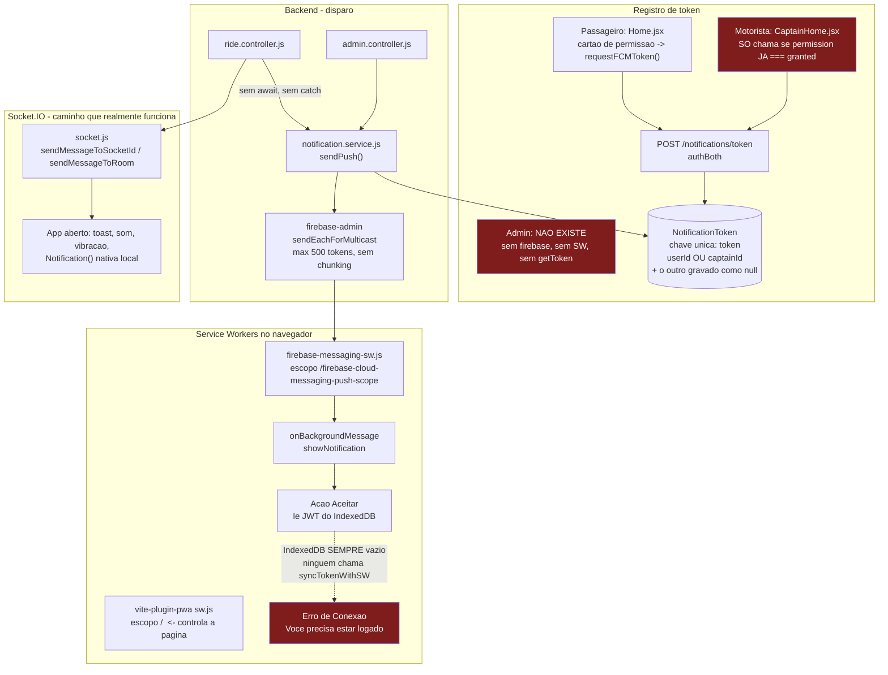

# Auditoria técnica — Sistema de notificações push do MoveCity

**Data:** 2026-08-02
**Escopo:** todos os módulos (corridas, pagamentos, carteira, chat, administração, campanhas), Firebase Client + Admin SDK, Service Workers, os três frontends, backend, banco e Socket.IO.
**Natureza:** diagnóstico. **Nenhum código foi alterado.**

---

## 0. Veredito em uma linha

O sistema de push **não está pronto para produção**. O caminho mais importante do produto — o motorista ser avisado de uma nova corrida quando não está com o app aberto — está quebrado em três pontos independentes, e qualquer um deles sozinho já o inutilizaria. O que funciona hoje, na prática, é o Socket.IO; o push é uma camada em cima que quase nunca entrega.

---

## 1. Fluxograma da arquitetura atual



---

## 2. Inventário completo das notificações

Legenda de status: **OK** = funciona · **PARCIAL** = funciona só por socket, ou só com app aberto · **QUEBRADO** = existe código mas não entrega · **NÃO IMPL.** = não existe.

| # | Notificação | Envia | Recebe | Gatilho | Arquivo : linha | Método | Endpoint | Evento Socket | Canal FCM | Status |
|---|---|---|---|---|---|---|---|---|---|---|
| 1 | Nova corrida disponível | Backend | Motorista | Passageiro cria corrida | `ride.controller.js:66` | `sendNewRide` | `POST /rides/create` | `new-ride` | `NEW_RIDE` + webpush actions | **QUEBRADO** (C1,C2,C3) |
| 2 | Corrida redespachada | Backend | Motorista | Motorista desiste / admin reatribui | `ride.controller.js:491` | `dispatchRideToCaptains` | `POST /rides/captain-cancel` | `new-ride` | `NEW_RIDE` | **QUEBRADO** (idem) |
| 3 | Corrida aceita | Backend | Passageiro | Motorista aceita | `ride.controller.js:154` | `sendRideAccepted` | `POST /rides/confirm`, `/rides/:id/accept` | `ride-confirmed` | `RIDE_ACCEPTED` | **PARCIAL** (socket OK; push só se o passageiro tiver token) |
| 4 | Corrida tomada por outro | Backend | Motoristas | Concorrência no aceite | `ride.controller.js:158` | `sendMessageToRoom` | — | `ride-taken` | — | **PARCIAL** (só socket, e sala presa a socketId) |
| 5 | Corrida iniciada | Backend | Passageiro | PIN validado | `ride.controller.js:223` | `sendRideStarted` | `GET /rides/start-ride` | `ride-started` | `RIDE_STARTED` | **PARCIAL** |
| 6 | Corrida finalizada | Backend | Passageiro | Motorista encerra | `ride.controller.js:289` | `sendRideFinished` | `POST /rides/end-ride` | `ride-ended` | `RIDE_FINISHED` | **PARCIAL** |
| 7 | Pagamento confirmado | Backend | Passageiro | Motorista confirma recebimento | `ride.controller.js:357` | `sendToUser` | `POST /rides/confirm-payment` | `payment-confirmed` | `ADMIN` (tipo errado) | **PARCIAL** |
| 8 | Pagamento efetuado | Backend | Motorista | Passageiro paga | `ride.controller.js:322` | — | `POST /rides/pay` | `payment-completed` | — | **PARCIAL** (só socket) |
| 9 | Motorista a caminho / chegou / aguardando | Backend | Passageiro | `updateRideStatus` | `ride.controller.js:254` | — | `POST /rides/update-status` | `ride-status-updated` | — | **PARCIAL** (só socket, sem push) |
| 10 | Corrida cancelada pelo passageiro | Backend | Motorista | Passageiro cancela | `ride.controller.js:524` | `sendMessageToRoom` | `POST /rides/cancel` | `ride-cancelled` | — | **PARCIAL** (sem push; sala frágil) |
| 11 | Corrida cancelada pelo motorista | Backend | Passageiro | Motorista desiste | `ride.controller.js:486` | `sendMessageToRoom` | `POST /rides/captain-cancel` | `ride-cancelled-by-captain` | — | **PARCIAL** |
| 12 | Carteira atualizada | Backend | Motorista | Movimentação financeira | `wallet.service.js:106` | `sendMessageToSocketId` | vários | `wallet-updated` | — | **PARCIAL** (só socket) |
| 13 | Resumo atualizado | Backend | Motorista | Movimentação financeira | `wallet.service.js:110` | `sendMessageToSocketId` | vários | `summary-updated` | — | **PARCIAL** |
| 14 | Recarga aprovada | — | Motorista | — | `notification.service.js:135` | `sendRechargeApproved` | — | — | `RECHARGE` | **CÓDIGO MORTO** (nunca chamado) |
| 15 | Promoção | — | Passageiro | — | `notification.service.js:141` | `sendPromotion` | — | — | `PROMOTION` | **CÓDIGO MORTO** (nunca chamado) |
| 16 | Notificação administrativa (legado) | Admin | Passageiros/Motoristas | — | `notification.service.js:147` | `sendAdminNotification` | `POST /api/admin/notifications` | — | `ADMIN` | **QUEBRADO** (C4: segmenta errado e duplica) — e sem UI |
| 17 | Campanha de marketing | Admin | Segmento | Cron 1/min ou disparo | `notification.service.js:201` | `processCampaign` | `POST /api/admin/campaigns` | — | tipo da campanha | **PARCIAL** (segmentação OK; quebra acima de 500 tokens; duplica com 2+ instâncias) |
| 18 | Nova mensagem no chat | Cliente→relay | Contraparte | `send-message` | `socket.js:154` | relay | `POST /chat/send` | `receive-message` | — | **QUEBRADO** (A7: só chega com o chat já aberto) |
| 19 | Digitando / entregue / lida | Cliente→relay | Contraparte | eventos de chat | `socket.js:161-186` | relay | — | vários | — | **PARCIAL** (só com chat aberto) |
| 20 | Localização do motorista | Backend | Passageiro/Admin | `update-location-captain` | `socket.js:118,132` | — | — | `captain-location-updated` | — | **OK** |
| 21 | Usuário bloqueado / desbloqueado | Admin | Usuário | `toggleUserBlock` | `admin.service.js:364` | — | `PATCH /api/admin/users/:id/block` | — | — | **NÃO IMPL.** |
| 22 | Motorista bloqueado / desbloqueado | Admin | Motorista | `toggleCaptainBlock` | `admin.service.js:561` | — | — | — | — | **NÃO IMPL.** |
| 23 | Motorista aprovado / reprovado | Admin | Motorista | fluxo de aprovação | `admin.service.js:979` | — | — | — | — | **NÃO IMPL.** |
| 24 | Nova avaliação recebida | — | Motorista/Passageiro | `submitReview` | `ride.controller.js:545,568` | — | `POST /rides/review` | — | — | **NÃO IMPL.** |
| 25 | Alertas para o admin (novo motorista, denúncia, chamado, problema) | — | Admin | — | — | — | — | — | — | **NÃO IMPL.** (admin não tem canal de push) |
| 26 | Webhook de pagamento (Asaas) aprovado/recusado/pendente | — | Passageiro/Motorista | webhook | `webhook.controller.js` | — | `POST /webhooks/asaas` | — | — | **NÃO IMPL.** (nenhuma notificação no webhook) |
| 27 | **Encomendas** — nova solicitação, motoboy aceitou, chegou, coletou, entregou, PIN | — | — | — | — | — | — | — | — | **NÃO IMPL.** (o módulo não existe; só a string `'aceita_encomendas'` em `ride.service.js:169` como tag de motorista) |

---

## 3. Problemas classificados por gravidade

### CRÍTICO

#### C1 — O botão "Aceitar" da notificação de corrida nunca funciona: o Service Worker jamais recebe o JWT
**Arquivos:** `frontend/src/services/swCommunication.js:1,10` · `frontend/public/firebase-messaging-sw.js:42-50,162-165`

O SW lê o JWT do IndexedDB (`getToken()`, linha 42) para chamar `POST /rides/:id/accept`. Quem deveria gravar esse JWT são `syncTokenWithSW()` e `clearTokenInSW()`. **Nenhuma das duas é chamada em lugar nenhum do projeto** (confirmado por grep em todo `frontend/src`). O IndexedDB está sempre vazio → `getToken()` devolve `undefined` → `throw new Error('UNAUTHORIZED')` → o motorista vê *"❌ Erro de Conexão — Você precisa estar logado"* toda vez que toca em "Aceitar".

Agravante independente: mesmo que fossem chamadas, elas usam `navigator.serviceWorker.controller`, que é o SW do **vite-plugin-pwa** (escopo `/`, gerado por `vite.config.js:18`), e não o `firebase-messaging-sw.js` (que o FCM registra em `/firebase-cloud-messaging-push-scope`). O `postMessage` iria para o worker errado, que ignora a mensagem.

**Impacto:** a principal proposta de valor do push para o motorista — aceitar sem abrir o app — não existe.
**Correção:** chamar `syncTokenWithSW` no login/refresh e `clearTokenInSW` no logout, obtendo o registro correto via `navigator.serviceWorker.getRegistration('/firebase-cloud-messaging-push-scope')` e usando `registration.active.postMessage`. **Atenção:** desde a auditoria de sessão (commit `6b8d7f6`) o access token vive **15 minutos** — sincronizar só no login não basta; precisa re-sincronizar a cada refresh, ou o SW deve usar o refresh token.

---

#### C2 — Em produção o Service Worker chama `http://localhost:4000`
**Arquivo:** `Backend/services/notification.service.js:96`

```js
data.apiUrl = process.env.BASE_URL || 'http://localhost:4000';
```

`BASE_URL` **não existe** no `Backend/.env` nem está documentado no `Backend/.env.example` (verificado). O fallback é sempre usado. Pior: o próprio backend roda em `PORT=3000`, então o fallback está errado até em desenvolvimento. O SW (`firebase-messaging-sw.js:134`) usa esse `apiUrl` para o aceite.

**Impacto:** segundo motivo independente para o "Aceitar" nunca funcionar. Em produção, o navegador do motorista tenta uma requisição para a própria máquina dele.
**Correção:** documentar e definir `BASE_URL` no Render; corrigir o fallback para `PORT`.

---

#### C3 — O motorista nunca é convidado a permitir notificações
**Arquivo:** `frontend/src/modules/driver/pages/CaptainHome.jsx:66-73`

```js
if ('Notification' in window && Notification.permission === 'granted') {
    await requestFCMToken();
}
```

Só busca o token se a permissão **já** estiver concedida. Não existe nenhum outro ponto no app do motorista que chame `Notification.requestPermission()` (grep confirma: só `fcm.js:20` e `Home.jsx:142`, ambos do passageiro). Um motorista novo nunca é perguntado, nunca gera token FCM, e portanto **nunca aparece em `NotificationToken`**.

Compare com o passageiro (`Home.jsx:128-146`), que tem um cartão de contexto antes do prompt nativo — bem feito, e ausente exatamente no perfil que mais depende de push.

**Impacto:** a base de tokens de motoristas é essencialmente vazia. `sendNewRide` aborta em `sendPush` com *"Nenhum token fornecido"*.
**Correção:** replicar o cartão de permissão do passageiro no app do motorista.

---

#### C4 — Segmentação administrativa envia para o público errado e duplica todo envio
**Arquivo:** `Backend/services/notification.service.js:152,156` · origem em `Backend/controllers/notification.controller.js:16-29`

`registerToken` monta `{ userId, captainId, device }` com uma das duas chaves sempre `null`. Mongoose **persiste o `null`**, e `{ $exists: true }` casa com campos de valor nulo.

**Verificado empiricamente** (banco em memória, reproduzindo `registerToken` e as duas consultas):

```
Documento do motorista gravado:  { token: 'TOKEN_MOTORISTA', captainId: ObjectId(...), userId: null }

target="passengers" -> [ 'TOKEN_PASSAGEIRO', 'TOKEN_MOTORISTA' ]
target="drivers"    -> [ 'TOKEN_PASSAGEIRO', 'TOKEN_MOTORISTA' ]
target="all"        -> [ 'TOKEN_PASSAGEIRO', 'TOKEN_MOTORISTA', 'TOKEN_PASSAGEIRO', 'TOKEN_MOTORISTA' ]

Segmentacao vaza para o publico errado? SIM
target="all" duplica envios?            SIM
```

**Impacto:** comunicado destinado a motoristas chega a passageiros e vice-versa; em `all`, **todo dispositivo recebe a mesma notificação duas vezes**. Risco reputacional e de conteúdo indevido (ex.: aviso de repasse financeiro de motorista chegando a passageiro).
**Correção:** trocar `$exists: true` por `{ $ne: null }`, ou não gravar a chave nula (`$unset`), e deduplicar a lista final.
**Observação:** o fluxo de **campanhas** (`processCampaign:215,224`) usa `$in` com listas de IDs distintas e **não** tem esse defeito — o bug está só no `sendAdminNotification` legado.

---

#### C5 — Falha ao notificar derruba o processo Node inteiro
**Arquivos:** `Backend/controllers/ride.controller.js:66,154,223,289` · `Backend/server.js` (sem handler)

As quatro chamadas são disparadas sem `await` e **sem `.catch()`**. Dentro de `sendToCaptain`/`sendToUser`, o `Notification.create(...)` e o `NotificationToken.find(...)` (`notification.service.js:59,62,78,82`) **não estão dentro de try/catch** — só o `sendPush` está. Qualquer erro de banco nesse trecho vira uma *unhandled promise rejection*, e `server.js` não registra `process.on('unhandledRejection')`. No Node 22 (versão em uso) o padrão é **encerrar o processo**.

Só a linha 357 (`confirmPaymentReceived`) tem `.catch(console.error)` — justamente a que já causou incidente antes, segundo o comentário em `notification.service.js:68-73`.

**Impacto:** uma instabilidade transitória do MongoDB durante o despacho de uma corrida derruba a API inteira, para todos os usuários.
**Correção:** `.catch()` em todas as chamadas, try/catch dentro do service, e um `unhandledRejection` global como rede de segurança.

---

### ALTO

| ID | Problema | Arquivo : linha | Impacto |
|---|---|---|---|
| **A1** | **O admin não recebe nenhuma push.** `admin-frontend` não tem a dependência `firebase` (verificado no `package.json`), não tem `firebase-messaging-sw.js` em `public/` (só `favicon.svg` e `icons.svg`), não chama `getToken()` nem `requestPermission()`. O painel só **envia**. | `admin-frontend/` (ausência) | Não existe canal de alerta operacional: novo motorista, denúncia, chamado, falha de pagamento — nada chega. |
| **A2** | **Tokens inválidos nunca são removidos.** `sendPush` apenas loga a falha. Nenhum `NotificationToken.delete*` existe no projeto (grep). | `notification.service.js:45-51` | A base só cresce; a taxa de falha do FCM sobe indefinidamente e o custo/latência de cada disparo junto. |
| **A3** | **Logout não desregistra o token FCM.** Em navegador compartilhado, o token continua vinculado ao usuário anterior até que outro faça login e o `upsert` o reatribua. | `UserLogout.jsx`, `CaptainLogout.jsx` (ausência) | Vazamento de privacidade: o próximo usuário do dispositivo vê notificações do anterior. |
| **A4** | **`registerToken` não verifica posse do token.** `findOneAndUpdate({token}, {userId: req.user._id}, {upsert:true})` — qualquer autenticado pode reivindicar um token FCM alheio. | `notification.controller.js:21` | Sequestro de canal: a vítima **para** de receber notificações e o dispositivo dela passa a receber as do atacante. |
| **A5** | **"Motorista chegou" não gera push.** `updateRideStatus` cobre `going_to_pickup`/`arrived`/`waiting_passenger` e só emite socket. | `ride.controller.js:243-272` | Com o app em segundo plano, o passageiro não é avisado de que o carro chegou — causa direta de cancelamento e de espera do motorista. |
| **A6** | **Cancelamento não alcança o motorista de forma confiável.** Sem push, e o `sendMessageToRoom('ride_<id>')` depende de o socket ainda estar na sala; a sala é populada por `socketId` no momento do despacho (`ride.controller.js:59`) e **socketId muda a cada reconexão**. | `ride.controller.js:512-527`, `socket.js:222` | Motorista que perdeu a conexão por um instante segue dirigindo para uma corrida cancelada. |
| **A7** | **Chat: nenhuma push, e o aviso de nova mensagem é código morto.** `RideChat.jsx:54` só faz `join-chat` quando o painel abre e `leave-chat` ao fechar (linha 88). Com o chat fechado o usuário não está na sala, então `socket.to('chat_<id>')` (`socket.js:157`) não o alcança. Logo, o `handleReceiveMessage` de `Riding.jsx:72` guardado por `if (!isChatOpen)` **nunca executa**. | `socket.js:154-159`, `RideChat.jsx:54,88`, `Riding.jsx:72-83`, `CaptainRiding.jsx:146` | Mensagem só aparece para quem já está com o chat aberto. Fora disso, silêncio absoluto. |
| **A8** | **Bloqueio/desbloqueio sem aviso.** O socket é derrubado (`disconnectSocket`) e a sessão revogada, sem nenhuma notificação. | `admin.service.js:364-399,561` | A pessoa é desconectada sem explicação; vira ticket de suporte. |
| **A9** | **Mensagens em primeiro plano nunca são exibidas.** `onMessageListener` (`fcm.js:51`) é exportado e **nunca importado** (grep). Sem `onMessage` registrado, com o app aberto o FCM não entrega nada visível. | `fcm.js:51-57` | Metade do ciclo de vida do push (app em foco) não existe. O que parece funcionar hoje é a `new Notification()` local disparada pelo socket (`CaptainHome.jsx:127`, `Home.jsx:253`), não o FCM. |
| **A10** | **`join-chat` sem autorização.** Qualquer socket conectado entra em `chat_<rideId>` só sabendo o id da corrida e passa a receber todas as mensagens daquela corrida. | `socket.js:140-145` | Leitura de conversas alheias entre passageiro e motorista. |

---

### MÉDIO

| ID | Problema | Arquivo : linha | Impacto |
|---|---|---|---|
| M1 | Cron de campanhas registrado no *import* do módulo, roda em toda instância; `processCampaign` lê o status e salva sem atomicidade (`findById` → checa → `save`). | `notification.service.js:201-206,261` | Com 2+ instâncias no Render, a mesma campanha é enviada em duplicidade. Também roda durante os testes. |
| M2 | `sendEachForMulticast` aceita no máximo 500 tokens; não há chunking em nenhum dos dois pontos de envio. | `notification.service.js:42,243` | Campanha com mais de 500 destinatários falha **inteira** e é marcada `failed`. Teto rígido de crescimento. |
| M3 | Envio sem retry, sem timeout e sem fila, dentro do ciclo de request. | `notification.service.js:9-55` | Lentidão do FCM atrasa a resposta de `POST /rides/create`; falha transitória = notificação perdida para sempre. |
| M4 | `Notification.create({ status: 'sent' })` é gravado **antes** do envio, e nunca corrigido para `failed`. | `notification.service.js:59,78,148` | O histórico e as métricas afirmam entrega que pode nunca ter ocorrido. |
| M5 | `enum` de `type` não cobre os tipos de campanha (`marketing`, `system`, …); "Pagamento Confirmado" é gravado como `ADMIN`. | `notification.model.js:25`, `ride.controller.js:357` | Categorização inconsistente; um `type` de campanha faria o `create` lançar erro de validação (que, por C5, derruba o processo). |
| M6 | `POST /api/admin/notifications` marcado no próprio código como *"Legacy (maybe used elsewhere)"* — nenhuma tela o consome. | `admin.routes.js:18` | Superfície de ataque viva expondo justamente o código com o bug C4. |
| M7 | `deepLink` das campanhas nunca é lido pelo SW — o `notificationclick` só trata `rideId`, senão abre `/captain-home`. | `firebase-messaging-sw.js:123-145` | Campanha com deep link para `wallet`/`promotions` leva o passageiro à home do motorista. |
| M8 | `metrics.opened` e `metrics.clicked` nunca são incrementados. | `notificationCampaign.model.js:54-55` | O painel exibe métricas de engajamento permanentemente zeradas. |
| M9 | `VITE_FIREBASE_VAPID_KEY` está em uso (`fcm.js:22`) e ausente do `frontend/.env.example`. Sem ela, `requestFCMToken` retorna `null` silenciosamente. | `frontend/.env.example` | Um deploy novo desliga o push inteiro sem nenhum erro visível. |
| M10 | O token FCM completo é impresso no log de produção. | `notification.service.js:48` | Credencial de endereçamento de push em logs (viabiliza A4). |
| M11 | `sendRechargeApproved` e `sendPromotion` nunca são chamados. | `notification.service.js:135,141` | Código morto que sugere funcionalidade inexistente. |
| M12 | O workbox faz precache de `**/*.js`, incluindo o próprio `firebase-messaging-sw.js`. | `vite.config.js:22` | Risco de servir uma versão obsoleta do worker de push após deploy. |

---

### BAIXO

| ID | Problema | Arquivo : linha |
|---|---|---|
| B1 | Config do Firebase duplicada e hardcoded no SW (inevitável em SW, mas pode divergir do `.env` sem ninguém perceber). | `firebase-messaging-sw.js:4-11` |
| B2 | `Sidebar` mostra Notificações só para `super_admin`/`operador`; a rota também aceita `marketing`. | `Sidebar.jsx:23` vs `admin.routes.js:18-22` |
| B3 | iOS/Safari só entrega Web Push em PWA instalada; não há detecção nem orientação ao usuário. | `fcm.js` |
| B4 | O lock `acceptingRide` do SW é uma variável de módulo — o SW pode ser encerrado e reiniciado entre eventos, zerando o lock. | `firebase-messaging-sw.js:97` |
| B5 | Traço `[AUDIT]` verboso em produção em todo o caminho de notificação. | `notification.service.js` (vários) |

---

## 4. Respostas diretas às perguntas do escopo

**Todas as notificações funcionam?** Não. Das 27 mapeadas: 1 plenamente OK, 12 parciais (só socket / só com app aberto), 4 quebradas, 2 código morto, 8 não implementadas.

**Alguma nunca é enviada?** Sim — itens 14 e 15 (código morto) e todo o grupo 21–27. E a de nova corrida (1 e 2), embora chamada, não chega por C3.

**Alguma vai para o usuário errado?** Sim — C4, comprovado empiricamente.

**Existe duplicidade?** Sim, duas: C4 (`target: 'all'` duplica cada envio) e M1 (campanha enviada uma vez por instância).

**Existe perda de notificações?** Sim: M3 (sem retry/fila), A2 (tokens inválidos acumulados), A6 (sala de socket presa a `socketId`), A7 (chat).

**Notificações apenas simuladas?** Sim, em dois sentidos: o que o usuário percebe hoje como "push" no app aberto é `new Notification()` **local**, disparada pelo socket (`CaptainHome.jsx:127`, `Home.jsx:253`, `CaptainRiding.jsx:63`) — não passa pelo FCM. E o filtro de palavrão do chat é explicitamente mock (`chat.controller.js:73-74`).

**Código morto?** `swCommunication.js` inteiro, `onMessageListener`, `sendRechargeApproved`, `sendPromotion`, `POST /admin/notifications`, e o `handleReceiveMessage` de `Riding.jsx:72`.

**Socket.IO x Push — a escolha está adequada?** A divisão conceitual está certa (socket para app em foco, push para app fechado), mas **na prática só o socket funciona**, e o push virou uma duplicação inoperante. Três casos exigem push e hoje só têm socket: **motorista chegou** (A5), **corrida cancelada** (A6) e **nova mensagem de chat** (A7) — todos acontecem justamente quando o usuário provavelmente **não** está com a tela aberta.

**Variáveis de ambiente:** duas ausências reais — `BASE_URL` no backend (C2) e `VITE_FIREBASE_VAPID_KEY` no `.env.example` do frontend (M9). O `admin-frontend/.env.example` não tem nada de Firebase, coerente com A1.

**Segurança:** A4 (sequestro de token), A10 (chat sem autorização), M10 (token em log), M6 (endpoint legado exposto com o bug C4). As credenciais do Admin SDK estão bem tratadas — env vars em produção, arquivo JSON só em dev, `.gitignore` cobrindo o JSON. Não há rate limit específico no disparo de campanhas além do global de 1000/15min.

---

## 5. Escalabilidade e prontidão

**Suporta milhares de usuários?** Não sem retrabalho. Três tetos concretos:

1. **500 destinatários por campanha** (M2) — teto rígido, falha total acima disso.
2. **Envio síncrono no request de corrida** (M3, C5) — o despacho de uma corrida faz `N` gravações + `N` consultas + `N` chamadas ao FCM em série dentro do `forEach` de `dispatchRideToCaptains` (`ride.controller.js:57-67`), sem `await` e sem controle de concorrência. Com muitos motoristas no raio, é uma rajada descontrolada.
3. **Nenhuma instância pode ser replicada com segurança** (M1) — o cron duplica campanhas; e o roteamento por `socketId` em documento (`socket.js:34-38`) não sobrevive a múltiplos processos sem um adaptador Redis para o Socket.IO.

**Está pronto para produção?** Não. C1+C2+C3 significam que, hoje, **nenhum motorista recebe push de corrida nova**, que é a razão de o sistema existir. C5 transforma uma instabilidade de banco em queda total da API.

---

## 6. Prioridade de correção sugerida

| Ordem | Itens | Por quê |
|---|---|---|
| **1** | C5 | É o único que derruba a plataforma inteira. Correção pequena e isolada. |
| **2** | C3, C2, C1 | Nesta ordem: sem token não há push; sem `BASE_URL` o aceite vai para lugar nenhum; sem o JWT no SW o aceite falha. Juntos, restauram o fluxo principal. |
| **3** | C4, M6 | Corrigir a segmentação ou remover o endpoint legado — enquanto existir, um disparo pode atingir o público errado. |
| **4** | A9, A5, A7 | Faz o push valer a pena: primeiro plano, "motorista chegou" e chat. |
| **5** | A2, A3, A4, A10 | Higiene de tokens e as duas falhas de autorização. |
| **6** | A1 | Canal de push para o admin (novo, não é conserto). |
| **7** | M1, M2, M3 | Fila, chunking e idempotência — pré-requisitos para escalar. |
| **8** | Demais MÉDIO/BAIXO | — |

---

## 7. Recomendação de arquitetura

O `notification.service.js` acumula hoje quatro responsabilidades (montar payload, consultar tokens, falar com o FCM, agendar cron). A separação que resolve a maior parte dos itens MÉDIO de uma vez:

- **`tokenRegistry`** — dono de `NotificationToken`: registro com verificação de posse, remoção no logout, e limpeza automática a partir dos códigos `messaging/registration-token-not-registered` que o FCM já devolve em `sendPush` e que hoje só são logados.
- **`pushTransport`** — único ponto que fala com o FCM: chunking de 500, retry com backoff, timeout, e devolução do resultado real por token.
- **`notificationDispatcher`** — regras de negócio (quem recebe o quê), gravando o `Notification` com o status **verdadeiro** após o envio.
- **Fila** (BullMQ/Redis, ou coleção com *lease* se preferir não adicionar infra) — desacopla o envio do request e permite o cron rodar em uma única instância.

---

## 8. Observação fora do escopo

Ao verificar o estado do repositório notei que a alteração de `Backend/seedTariff.js` (ícones das categorias / desativação do TukTuk) já está no `HEAD`, incluída no commit `c06599d`. Continuam **não commitados**: `Backend/scripts/fix-vehicle-categories.js`, a alteração em `VehiclePanel.jsx` e este documento. A migração ainda **não foi executada contra o banco real** — sem isso o TukTuk continua aparecendo e a moto segue com ícone de carro em produção.

---

## 9. Método

Auditoria por leitura direta do código, sem alterações. O item C4 foi confirmado **empiricamente** (não por inspeção): banco MongoDB em memória, reproduzindo exatamente o `registerToken` de `notification.controller.js` e as duas consultas de `sendAdminNotification`, com a saída transcrita na íntegra na seção C4. O script de verificação era descartável e foi removido após a coleta. Os demais achados de "nunca é chamado" foram confirmados por busca exaustiva em `frontend/src`, `admin-frontend/src` e `Backend/`.
